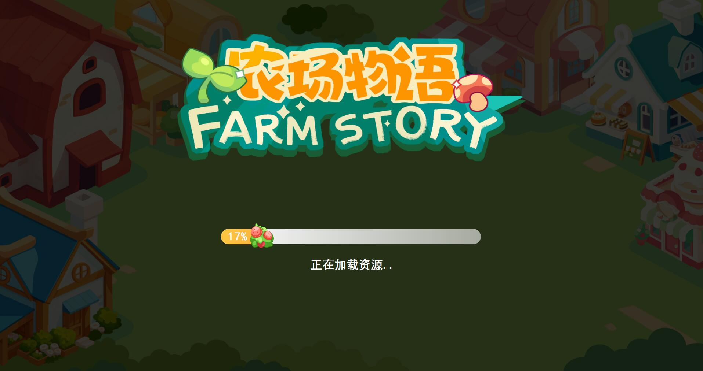
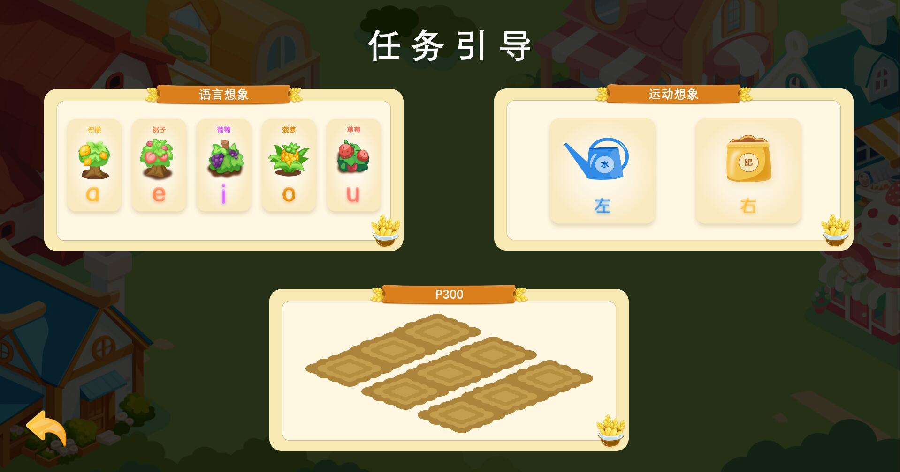
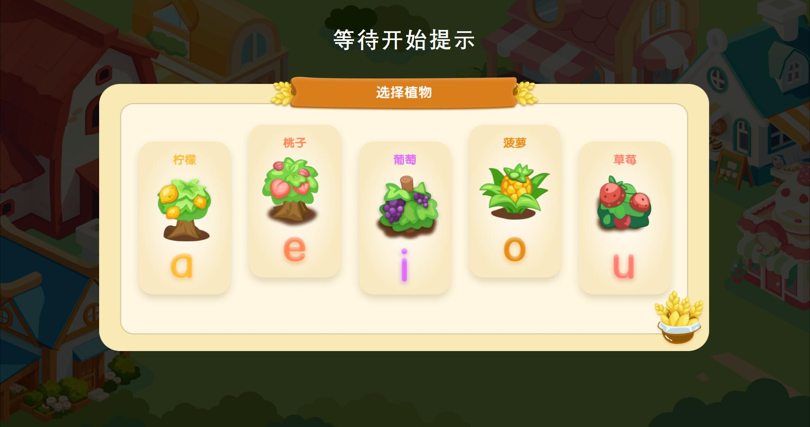
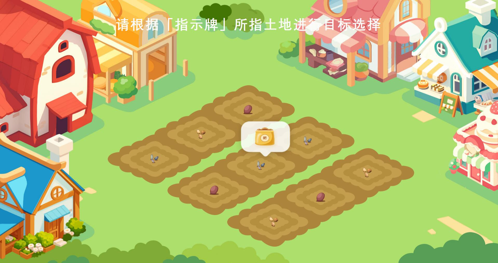
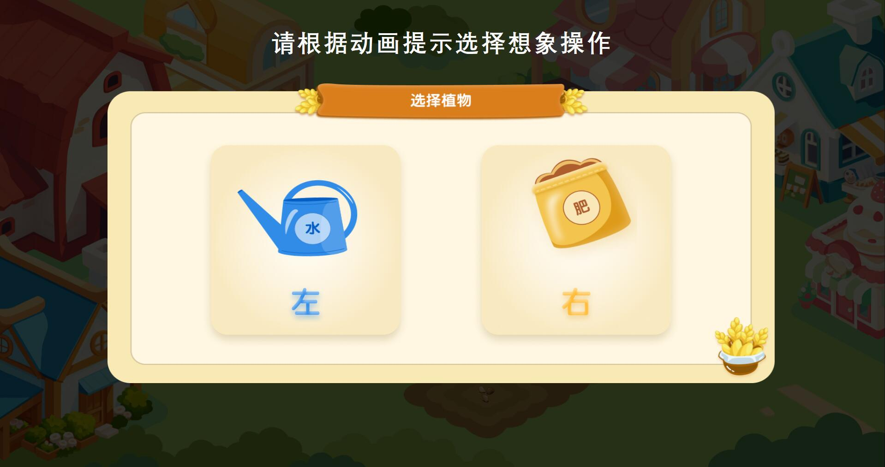
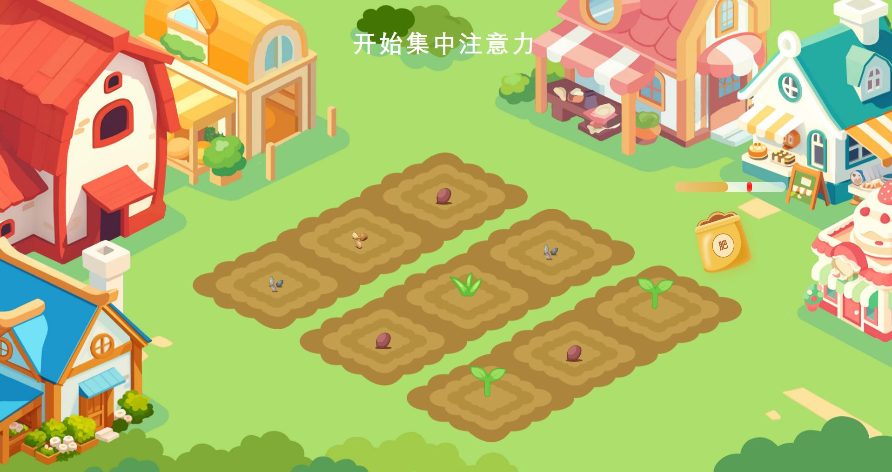
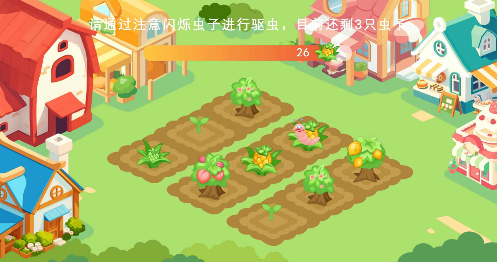
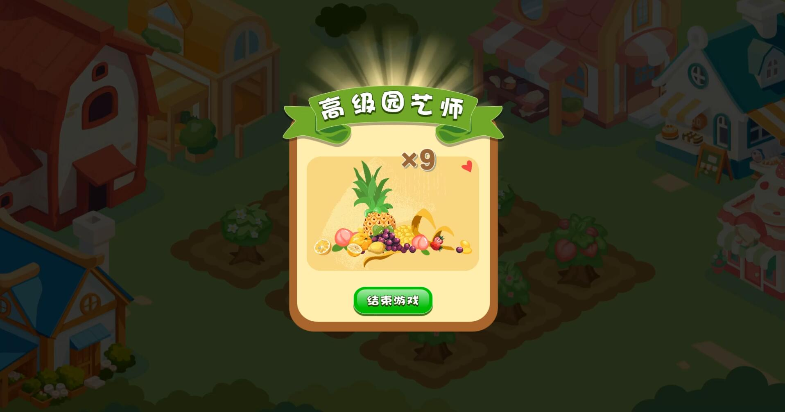

# MetaBCI-DTx

## 应用概述

MetaBCI-DTx 是一款基于 MetaBCI 为底层框架搭建的一种数字疗法解决方案。该解决方案目标是以游戏设计作为切入点，提升用户的参与度，增强治疗的的趣味性。目前，已上线一款以农场种植为主题的游戏，该游戏是基于多种脑机接口(BCI)范式的神经康复训练游戏，专门为自闭症谱系障碍、注意缺陷多动障碍等神经发育障碍患儿以及运动功能障碍患儿设计。通过整合运动想象、语音识别和视觉刺激等多种BCI控制逻辑，结合MetaBCI架构，本项目能够提供个性化和趣味性的康复训练方案。

## 优势特点

1. ##### 运动想象与SSVEP的实现采用 MetaBCI 框架中的内置算法

2. ##### P300 信号的处理基于支持向量机（SVM）进行

3. ##### 注意力的量化计算依赖于 alpha 波与 beta 波的频率比值分析

4. ##### 元音想象的识别与分类通过应用基于模型无关元学习（MAML）的策略结合多层神经网络来实现

## 环境搭建

1. ##### 克隆代码

   ```shell
   git clone git@github.com:arfysica/MetaBCI-DTx.git
   ```

2. ##### 切换分支

   ```shell
   git checkout feature/dtx
   ```

3. ##### 准备环境

   ```shell
   cd MetaBCI-DTx
   
   # 如需使用虚拟环境，请自行构建，构建完成后，执行下述命令
   pip install -r requirements.txt
   ```

4. ##### 启动项目

   ```shell
   # 启动服务端，主要用于数据分析与处理、以及模拟数据
   cd dataProcess
   
   # 根据实际需要，设置路径位置，默认为项目根路径的 data 目录和启动脚本同级目录的 LangMode.pth 文件
   python gAmpli.py [-p 指定生成数据的路径] [-m 指定语言想象范式数据集的路径]
   
   # 启动客户端，主要运行农场主题游戏
   cd game
   
   # 启动游戏
   python main_scene.py
   ```

## 游戏介绍

游戏是一款农场种植为主题的游戏，游戏主要包括4个阶段，分别是**播种选择、植物成长、除草护理、成熟收获**。另外，除主游戏进程外，游戏还包括游戏加载启动、设置训练模型等其他场景。

1. ##### 播种选择阶段

   （1）从5种植物种子中依次选择3种

   （2）选中后，更新状态为选中

   （3）选择后的种子不再参与后续选择

   （4）将选中的种子随机播种在九块土地上

2. ##### 植物成长阶段

   （1）依次完成「选地」-「养护」任务

   （2）选地阶段：随机某地上方出现花洒，土地依次闪烁，识别成功执行（3）养护任务

   （3）养护任务包括「浇水/施肥」和「力度控制」

   （4）选择养护方式，浇水（左）和施肥（右），如果（2）出现是花洒，则引导用户想象浇水，否则是施肥

   （5）控制养护力度，设置5秒范围，数值超过60，表示浇水/施肥成功

   （6）养护任务执行3轮，9块土地依次养护，如果养护成功，植物状态升级，否则不变

3. ##### 除草护理阶段

   （1）植物分4个状态等级，包括萌芽期、幼苗期、生长期、成熟期

   （2）未满成熟期的植物才有除草/除虫任务

   （3）9块土地按照指定频率闪烁，随机选取至多3块未满成熟期的植物出现杂草/害虫

   （4）限时30秒，完成除草/除虫任务，若除草/除虫成功，植物状态升级，否则不变

4. ##### 成熟收获阶段

   （1）上述3个阶段完成，收获已达到成熟期的植物

   （2）根据成熟植物数量给予称号

   ​     1）初级园艺师：收获0~3棵植物

   ​     2）中级园艺师：收获4~6棵植物

   ​     3）高级园艺师：收获7~9棵植物

   （3）根据整个阶段产生的脑电波形，挑选一段波形数据生成一段庆祝音乐（敬请期待）

## 游戏预览

- ##### 游戏启动

  

- ##### 设置训练模型

  

- ##### 选择植物

    

- ##### 选择土地

    

- ##### 选择养护方式

    

- ##### 集中注意力

    

- ##### 除虫任务

    

- ##### 游戏结算

    

## License

> Distributed under the GNU General Public License v2.0 License. See [LICENSE](./LICENSE) for more information.